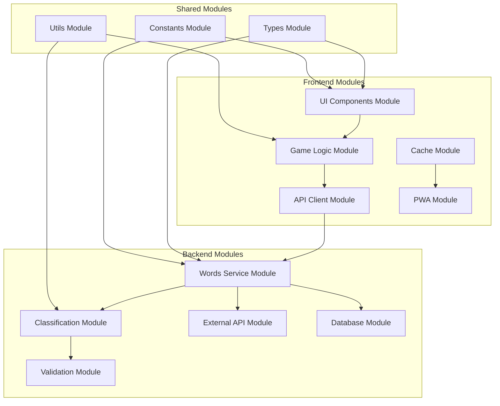

# Documento de Diseño

## Visión General

La aplicación será una Progressive Web App (PWA) desarrollada con tecnologías web modernas que permita el acceso desde cualquier dispositivo. Utilizará una arquitectura cliente-servidor donde el frontend consume una API REST para obtener palabras en español y determinar su clasificación de acentuación.

## Arquitectura

### Arquitectura Modular


### Módulos del Sistema

#### Frontend Modules

1. **UI Components Module** (`/src/components`)
   - Componentes reutilizables de interfaz
   - Sistema de diseño consistente
   - Componentes atómicos y moleculares

2. **Game Logic Module** (`/src/game`)
   - Lógica de estado del juego
   - Manejo de puntuaciones y estadísticas
   - Flujo de preguntas y respuestas

3. **API Client Module** (`/src/api`)
   - Cliente HTTP configurado
   - Interceptores para manejo de errores
   - Tipos de respuesta de API

4. **Cache Module** (`/src/cache`)
   - Gestión de IndexedDB
   - Estrategias de cache
   - Sincronización offline/online

5. **PWA Module** (`/src/pwa`)
   - Service Worker
   - Manifest configuration
   - Push notifications (futuro)

#### Backend Modules

1. **Words Service Module** (`/src/services/words`)
   - Orquestación de obtención de palabras
   - Lógica de negocio principal
   - Interfaz unificada para diferentes fuentes

2. **Classification Module** (`/src/classification`)
   - Algoritmos de clasificación de acentos
   - Reglas de acentuación española
   - Generación de explicaciones

3. **External API Module** (`/src/external`)
   - Integración con APIs externas
   - Adaptadores para diferentes proveedores
   - Rate limiting y retry logic

4. **Database Module** (`/src/database`)
   - Modelos de datos
   - Repositorios
   - Migraciones y seeds

5. **Validation Module** (`/src/validation`)
   - Esquemas de validación
   - Sanitización de datos
   - Reglas de negocio

#### Shared Modules

1. **Types Module** (`/shared/types`)
   - Interfaces TypeScript compartidas
   - Tipos de dominio
   - DTOs para API

2. **Utils Module** (`/shared/utils`)
   - Funciones utilitarias
   - Helpers comunes
   - Formatters

3. **Constants Module** (`/shared/constants`)
   - Configuraciones
   - Enums
   - Valores por defecto

### Interfaces Entre Módulos

#### Frontend Module Interfaces

```typescript
// Game Logic Module Interface
interface IGameService {
  startNewGame(): void;
  submitAnswer(answer: AccentType): Promise<AnswerResult>;
  getStats(): GameStats;
  resetStats(): void;
}

// API Client Module Interface
interface IApiClient {
  getRandomWord(): Promise<Word>;
  getBatchWords(count: number): Promise<Word[]>;
}

// Cache Module Interface
interface ICacheService {
  getWord(): Promise<Word | null>;
  storeWords(words: Word[]): Promise<void>;
  clearCache(): Promise<void>;
  getCacheStatus(): Promise<CacheStatus>;
}
```

#### Backend Module Interfaces

```typescript
// Words Service Interface
interface IWordsService {
  getRandomWord(): Promise<Word>;
  getBatchWords(count: number): Promise<Word[]>;
}

// Classification Module Interface
interface IClassificationService {
  classifyWord(word: string): AccentClassification;
  generateExplanation(word: string, type: AccentType): string;
  validateClassification(word: string, type: AccentType): boolean;
}

// Database Module Interface
interface IWordsRepository {
  findRandom(): Promise<Word | null>;
  findByType(type: AccentType): Promise<Word[]>;
  create(word: CreateWordDto): Promise<Word>;
  findMany(limit: number): Promise<Word[]>;
}
```

### Patrones de Diseño Implementados

1. **Repository Pattern**: Para acceso a datos
2. **Service Layer Pattern**: Para lógica de negocio
3. **Adapter Pattern**: Para APIs externas
4. **Observer Pattern**: Para actualizaciones de estado
5. **Strategy Pattern**: Para diferentes fuentes de palabras
6. **Factory Pattern**: Para creación de componentes
7. **Dependency Injection**: Para desacoplamiento de módulos

## Componentes e Interfaces

### Frontend Components

#### 1. GameComponent
- **Responsabilidad**: Controlar el flujo del juego
- **Props**: ninguna
- **Estado**: 
  - `currentWord: string`
  - `gameStats: GameStats`
  - `isLoading: boolean`
  - `gameState: 'playing' | 'answered' | 'loading'`

#### 2. WordDisplayComponent
- **Responsabilidad**: Mostrar la palabra actual
- **Props**: 
  - `word: string`
  - `isRevealed: boolean`

#### 3. AnswerButtonsComponent
- **Responsabilidad**: Botones de selección de respuesta
- **Props**:
  - `onAnswer: (type: AccentType) => void`
  - `disabled: boolean`
  - `correctAnswer?: AccentType`

#### 4. StatsComponent
- **Responsabilidad**: Mostrar estadísticas del juego
- **Props**:
  - `stats: GameStats`

#### 5. ResultFeedbackComponent
- **Responsabilidad**: Mostrar resultado de la respuesta
- **Props**:
  - `isCorrect: boolean`
  - `correctAnswer: AccentType`
  - `explanation: string`

### Backend Endpoints

#### GET /api/words/random
- **Descripción**: Obtiene una palabra aleatoria con su clasificación
- **Respuesta**:
```json
{
  "word": "teléfono",
  "accentType": "esdrujula",
  "explanation": "Palabra esdrújula porque el acento está en la antepenúltima sílaba (te-LÉ-fo-no)"
}
```

#### GET /api/words/batch
- **Descripción**: Obtiene múltiples palabras para cache offline
- **Parámetros**: `count` (número de palabras, máximo 50)
- **Respuesta**:
```json
{
  "words": [
    {
      "word": "canción",
      "accentType": "aguda",
      "explanation": "Palabra aguda terminada en 'n'"
    }
  ]
}
```

## Modelos de Datos

### Tipos TypeScript

```typescript
type AccentType = 'aguda' | 'grave' | 'esdrujula';

interface Word {
  word: string;
  accentType: AccentType;
  explanation: string;
  syllables?: string[];
}

interface GameStats {
  correct: number;
  incorrect: number;
  streak: number;
  totalAnswered: number;
}

interface GameState {
  currentWord: Word | null;
  stats: GameStats;
  isLoading: boolean;
  gamePhase: 'waiting' | 'answering' | 'feedback';
  lastAnswer?: {
    selected: AccentType;
    isCorrect: boolean;
  };
}
```

### Base de Datos (SQLite/PostgreSQL)

```sql
CREATE TABLE words (
  id INTEGER PRIMARY KEY,
  word VARCHAR(100) NOT NULL UNIQUE,
  accent_type VARCHAR(20) NOT NULL,
  explanation TEXT,
  syllables JSON,
  created_at TIMESTAMP DEFAULT CURRENT_TIMESTAMP
);

CREATE INDEX idx_words_accent_type ON words(accent_type);
```

## Manejo de Errores

### Frontend
1. **Error de Conexión**: Mostrar mensaje y usar cache offline
2. **Error de API**: Mostrar mensaje de error con botón de reintentar
3. **Cache Vacío**: Solicitar conexión a internet

### Backend
1. **API Externa No Disponible**: Usar palabras de base de datos local
2. **Base de Datos No Disponible**: Retornar error 503 con mensaje descriptivo
3. **Validación de Datos**: Retornar error 400 con detalles específicos

## Estrategia de Testing

### Frontend Testing
1. **Unit Tests**
   - Componentes individuales con Jest y React Testing Library
   - Funciones de utilidad (clasificación de acentos)
   - Service Worker functionality

2. **Integration Tests**
   - Flujo completo del juego
   - Interacción con API
   - Funcionalidad offline

3. **E2E Tests**
   - Cypress para flujos de usuario completos
   - Testing en diferentes dispositivos/resoluciones

### Backend Testing
1. **Unit Tests**
   - Lógica de clasificación de acentos
   - Funciones de utilidad
   - Validación de datos

2. **Integration Tests**
   - Endpoints de API
   - Integración con base de datos
   - Integración con API externa

3. **Performance Tests**
   - Carga de múltiples requests simultáneos
   - Tiempo de respuesta de endpoints

## Tecnologías Seleccionadas

### Frontend
- **React 18** con TypeScript
- **Vite** para build y desarrollo
- **Tailwind CSS** para estilos responsive
- **Workbox** para Service Worker y PWA
- **IndexedDB** para cache offline

### Backend
- **Node.js** con Express
- **TypeScript** para type safety
- **SQLite** para desarrollo, PostgreSQL para producción
- **Prisma** como ORM
- **Axios** para llamadas a API externa

### Deployment
- **Frontend**: Vercel o Netlify
- **Backend**: Railway o Render
- **Base de Datos**: PostgreSQL en la nube (Supabase/PlanetScale)

## Consideraciones de Performance

1. **Lazy Loading**: Cargar componentes bajo demanda
2. **Memoización**: React.memo para componentes que no cambian frecuentemente
3. **Cache Strategy**: Cache-first para palabras, network-first para estadísticas
4. **Bundle Splitting**: Separar código de vendor del código de aplicación

## Consideraciones de Accesibilidad

1. **Keyboard Navigation**: Todos los botones accesibles por teclado
2. **Screen Readers**: Etiquetas ARIA apropiadas
3. **Color Contrast**: Cumplir con WCAG 2.1 AA
4. **Focus Management**: Indicadores visuales claros de focus