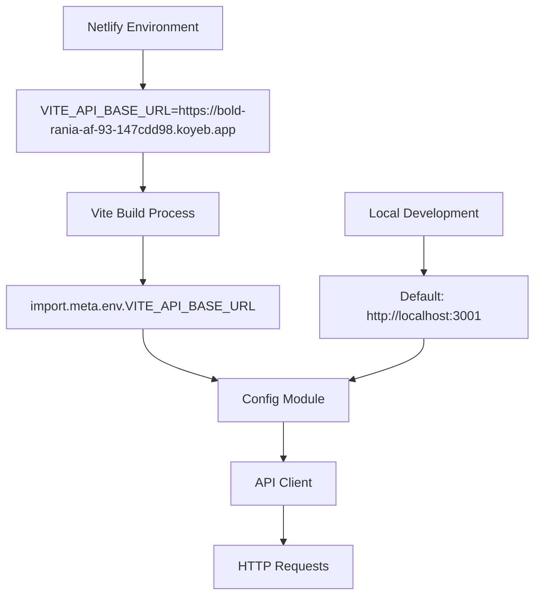

# Documento de Diseño - Configuración de Variables de Entorno

## Visión General

Este diseño aborda la corrección del manejo de variables de entorno en la aplicación clasificador-acentos, específicamente para resolver el problema donde las peticiones API fallan con 404 porque no se está usando correctamente la URL base configurada en `VITE_API_BASE_URL`.

### Problema Actual

1. La variable `VITE_API_BASE_URL` está configurada en Netlify pero no se usa correctamente
2. El código actual intenta acceder a `window.VITE_API_BASE_URL` en lugar de `import.meta.env.VITE_API_BASE_URL`
3. El cliente de API usa `baseURL: '/api'` (relativo) en lugar de la URL completa del servidor
4. Las peticiones se dirigen a `https://clasificador-acentos.netlify.app/api/words/random` en lugar de `https://bold-rania-af-93-147cdd98.koyeb.app/api/words/random`

## Arquitectura

### Configuración de Variables de Entorno



### Flujo de Configuración

1. **Build Time**: Vite inyecta las variables de entorno que empiezan con `VITE_`
2. **Runtime**: La aplicación accede a estas variables a través de `import.meta.env`
3. **Fallback**: Si no está definida, usa URL de desarrollo local

## Componentes y Interfaces

### 1. Módulo de Configuración (`config/environment.ts`)

```typescript
interface EnvironmentConfig {
  apiBaseUrl: string;
  isDevelopment: boolean;
  isProduction: boolean;
  enableDebugLogs: boolean;
}

export const config: EnvironmentConfig
```

### 2. Cliente API Actualizado (`api/client.ts`)

```typescript
class ApiClient {
  private client: AxiosInstance;
  private baseUrl: string;
  
  constructor(baseUrl: string);
  setupInterceptors(): void;
  logConfiguration(): void;
}
```

### 3. Utilidades de Debug (`utils/debug.ts`)

```typescript
interface DebugInfo {
  apiBaseUrl: string;
  environment: string;
  timestamp: string;
}

export function logEnvironmentInfo(): void;
export function validateConfiguration(): boolean;
```

## Modelos de Datos

### Configuración de Entorno

```typescript
interface EnvironmentConfig {
  apiBaseUrl: string;           // URL base de la API
  isDevelopment: boolean;       // Modo desarrollo
  isProduction: boolean;        // Modo producción  
  enableDebugLogs: boolean;     // Habilitar logs de debug
  requestTimeout: number;       // Timeout para peticiones
}
```

### Información de Debug

```typescript
interface DebugInfo {
  apiBaseUrl: string;          // URL que se está usando
  environment: string;         // Entorno actual
  timestamp: string;           // Momento de la verificación
  configSource: 'env' | 'default'; // Fuente de la configuración
}
```

## Manejo de Errores

### Estrategia de Manejo de Errores

1. **Errores de Configuración**
   - Validar que la URL base sea válida
   - Mostrar warnings en desarrollo si usa valores por defecto
   - Registrar información de configuración en consola

2. **Errores de Conectividad**
   - Detectar errores 404 específicamente
   - Proporcionar mensajes de error más descriptivos
   - Sugerir verificar configuración cuando sea apropiado

3. **Errores de Red**
   - Mantener el manejo actual de timeouts
   - Mejorar mensajes para errores de CORS
   - Implementar retry logic para errores temporales

### Códigos de Error Específicos

```typescript
enum ApiErrorCodes {
  CONFIGURATION_ERROR = 'CONFIG_ERROR',
  NETWORK_ERROR = 'NETWORK_ERROR',
  NOT_FOUND = 'NOT_FOUND',
  SERVER_ERROR = 'SERVER_ERROR',
  TIMEOUT = 'TIMEOUT'
}
```

## Estrategia de Testing

### Tests Unitarios

1. **Configuración de Entorno**
   - Verificar que se lee correctamente `import.meta.env.VITE_API_BASE_URL`
   - Probar fallback a URL por defecto
   - Validar detección de entorno

2. **Cliente API**
   - Verificar que usa la URL base correcta
   - Probar manejo de errores mejorado
   - Validar logs de debug

3. **Utilidades de Debug**
   - Probar logging de información de entorno
   - Verificar validación de configuración

### Tests de Integración

1. **Conectividad API**
   - Probar peticiones en diferentes entornos
   - Verificar manejo de errores de red
   - Validar comportamiento con URLs inválidas

### Tests E2E

1. **Flujo Completo**
   - Verificar que la aplicación funciona en producción
   - Probar recuperación de errores de conectividad
   - Validar experiencia de usuario con errores

## Consideraciones de Implementación

### Cambios Mínimos Requeridos

1. **Reemplazar acceso a variables de entorno**
   - Cambiar `window.VITE_API_BASE_URL` por `import.meta.env.VITE_API_BASE_URL`
   - Mover configuración a módulo dedicado

2. **Actualizar cliente API**
   - Usar URL base completa en lugar de relativa
   - Mejorar logging y manejo de errores

3. **Agregar validación y debug**
   - Implementar logging de configuración
   - Agregar validación de URLs

### Compatibilidad

- Mantener compatibilidad con desarrollo local
- Asegurar que funcione en todos los entornos de Netlify
- Preservar funcionalidad existente de proxy de Vite en desarrollo

### Performance

- Configuración se evalúa una sola vez al inicializar
- Logs de debug solo en modo desarrollo
- Sin impacto en el tamaño del bundle de producción